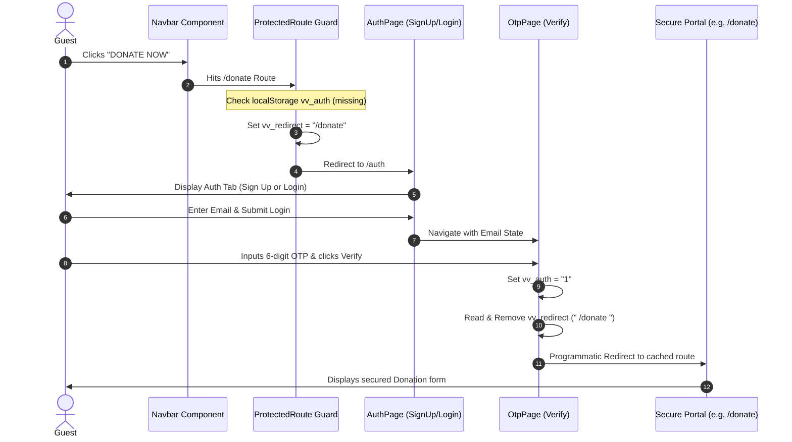
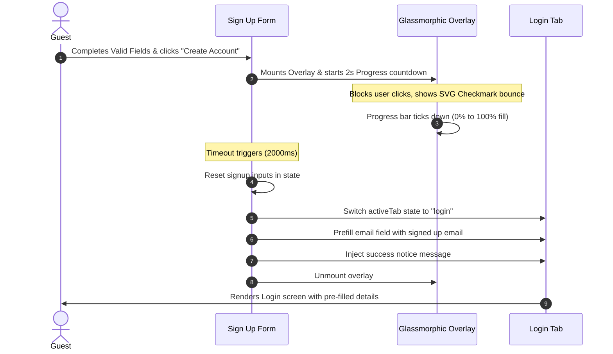
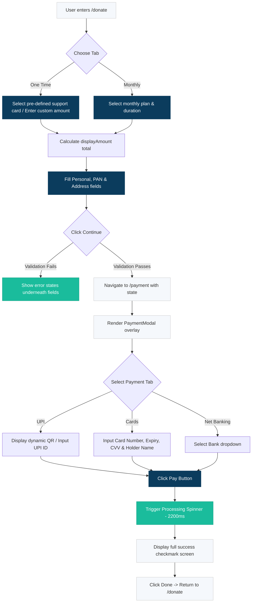

# Vidyavaidya Frontend Architecture & Navigation Analysis

This document provides a comprehensive, deep-dive analysis of the **Vidyavaidya** React frontend codebase. It outlines the technology stack, application routing architecture, session & security mechanisms, detailed navigation paths, state structures, and full UI/UX workflows.

---

## 🛠️ Technology Stack & Core Ecosystem

- **Framework**: React 18+ powered by **Vite** for rapid bundling.
- **Routing Engine**: `react-router-dom` (v6+) for single-page routing, route nesting, and programmatic stateful navigation.
- **Styling Paradigm**: Vanilla CSS combined with **TailwindCSS** for responsive utility-first layouts. Custom stylesheets reside alongside components for granular capsule-scoped styling (e.g., `AuthPage.css`, `Donate.css`).
- **Iconography**: `lucide-react` for smooth, vector-based clean layout icons.
- **State Management**: React Context / Hooks (`useState`, `useMemo`, `useEffect`) driving localized reactive state pipelines.

---

## 📂 Core Routing Map (`src/App.jsx`)

The routing architecture defines how public and private parts of the application are organized.

```mermaid
graph TD
    classDef public fill:#e8f8f5,stroke:#1abc9c,stroke-width:2px;
    classDef protected fill:#eef3f7,stroke:#0b3c5d,stroke-width:2px;
    
    A[Root Route /] :::public --> B[Landing Page]:::public
    A --> C[Auth /auth]:::public
    A --> D[Verify OTP /otp]:::public
    
    A --> E[ProtectedRoute Guard]:::protected
    E --> F[Dashboard /dashboard]:::protected
    E --> G[Donate /donate]:::protected
    E --> H[Payment Checkout /payment]:::protected
    E --> I[Join Community /join-community]:::protected
    E --> J[Forms: Volunteer / Donor / Corporate / Hospital]:::protected
```

| Path | Component | Auth Type | Purpose |
| :--- | :--- | :--- | :--- |
| `/` | `LandingPage` | **Public** | Primary index page displaying mission statements, photo/video gallery dropdowns, statistics, team grids, and CTAs. |
| `/auth` | [AuthPage.jsx](file:///d:/project/vidyavaidya/src/pages/AuthPage.jsx) | **Public** | Handles credential input for both Login (OTP request) and SignUp (with success overlay and 2-second redirection). |
| `/otp` | [OtpPage.jsx](file:///d:/project/vidyavaidya/src/pages/OtpPage.jsx) | **Public** | Verification form for a 6-digit OTP code, which sets active credentials. |
| `/dashboard` | [Dashboard.jsx](file:///d:/project/vidyavaidya/src/pages/Dashboard.jsx) | **Protected** | Secure donor panel showing metrics, transaction logs, categorical filters, and donation frequencies. |
| `/donate` | [Donate.jsx](file:///d:/project/vidyavaidya/src/pages/Donate.jsx) | **Protected** | Interactive Donation Portal featuring One-Time support cards, Monthly plans, and Foreign Donor (FCRA) forms. |
| `/payment` | `Payment.jsx` | **Protected** | Simulated secure transaction screen rendered via `PaymentModal.jsx`. |
| `/join-community`| [JoinCommunity.jsx](file:///d:/project/vidyavaidya/src/pages/JoinCommunity.jsx) | **Protected** | Onboarding directory with specialized application paths. |
| `/join/:type` | `VolunteerForm` / `DonorForm` etc. | **Protected** | Layout-guided forms ([FormLayout.jsx](file:///d:/project/vidyavaidya/src/Components/FormLayout.jsx)) to gather volunteer/collaborator detail. |

---

## 🔒 Security Guard & Session Lifecycle

Vidyavaidya maintains user sessions purely client-side through localized browser storage keys:
- **`vv_auth`**: Acts as a boolean session token (`"1"` represents an active session).
- **`vv_redirect`**: Stores the context-aware target path when a guest tries to load a secure route.

### Route Guard Implementation ([ProtectedRoute.jsx](file:///d:/project/vidyavaidya/src/routes/ProtectedRoute.jsx))
```javascript
const ProtectedRoute = ({ children }) => {
  const isAuth = localStorage.getItem("vv_auth");
  const location = useLocation();

  if (!isAuth) {
    // Cache the original target route
    localStorage.setItem("vv_redirect", location.pathname);
    return <Navigate to="/auth" replace />;
  }
  return children;
};
```

---

## 🔄 Sequence Flows & User Navigation Journeys

### 1. Seamless Intercepted Authentication Flow
When an unauthenticated guest clicks **"DONATE NOW"** or **"Join in the Community"** on the main navigation:



### 2. Sign Up Verification and Tab REDIRECT (New Feature!)
When a guest completes a successful Sign Up:



### 3. Donation and Payment Gateway Flow
A detailed view of how transactions are managed:



---

## 📊 Component & State Structure

### 1. [AuthPage.jsx](file:///d:/project/vidyavaidya/src/pages/AuthPage.jsx)
- **Primary States**:
  - `activeTab` (`"login"` | `"signup"`): Drives forms visibility.
  - `loginEmail` / `signupEmail`: Field bindings.
  - `fullName` / `phone`: Registrant details.
  - `errors` (Object): Field-specific validation indicators.
  - `signupNotice` (String): Message rendered inside the Login form.
  - `showSuccessPopup` (Boolean): Master toggle for the timed success overlay.

### 2. [Donate.jsx](file:///d:/project/vidyavaidya/src/pages/Donate.jsx)
- **Primary States**:
  - `tab` (`"onetime"` | `"monthly"` | `"foreign"`): Layout controller.
  - `selectedAmounts` (Array): Tracks multi-selected one-time cards (e.g. `[1000, 5000]`).
  - `customAmount` (String): Binds custom number field.
  - `monthlyAmount` (Number): Binds single-select monthly commitments.
  - `duration` (Number): Selected subscription period (e.g. `3, 6, 12` months).
  - `form` (Object): Aggregates guest credentials (Name, PAN, State, Alumni tags).

### 3. [Dashboard.jsx](file:///d:/project/vidyavaidya/src/pages/Dashboard.jsx)
- **Primary States**:
  - `search` (String): Binds transaction log filter.
  - `category` / `type` / `status` (Strings): Grid filters for transaction categorization.
  - `isRefreshing` (Boolean): Controls refreshing feedback for user statistics.

---

## 💡 Key Design Patterns Used

1. **Lazy State Initialization**:
   Used in `AuthPage.jsx` to prefill properties directly from router states without breaking re-renders:
   ```javascript
   const [activeTab, setActiveTab] = useState(() => location.state?.tab === "signup" ? "signup" : "login");
   ```
2. **Tabbed Component Toggles**:
   Avoids heavy unmounts and remounts by utilizing conditional rendering flags inside single page templates, improving overall execution speed.
3. **Sticky Bottom CTA Bars**:
   Featured in `Donate.jsx` to maintain a visual calculation of donation commitments and trigger standard validation checks from any page coordinate.
4. **Interactive SVG Animations**:
   Leverages inline SVGs with keyframe stroke transitions to avoid dependency bloating, delivering visual feedback at zero bundle size cost.
